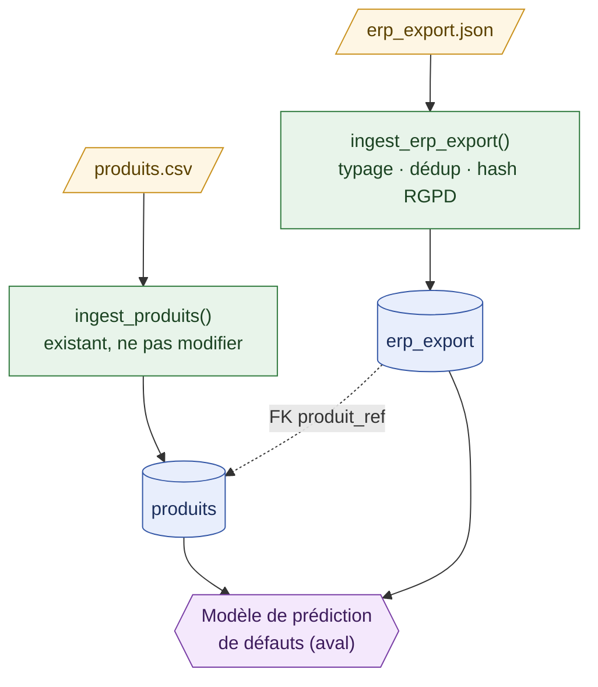

# M3-B2 — Squelette repo (pipeline + migration Acerox)

## Architecture
 

 
**Points clés du schéma :**
- `erp_export.produit_ref` est une vraie clé étrangère vers `produits.produit_ref` (flèche pointillée, cf. `decisions.md` section 1).
- `ouvrier_id` n'est jamais stocké en clair : seule la colonne `ouvrier_id_hash` (SHA-256 salé) existe en base, nullable (cf. `decisions.md` section 3).
- La BDD alimente en aval le modèle de prédiction de défauts déjà en production — hors périmètre de ce brief.
---

## Reproduire la livraison (3 commandes)

Pré-requis : environnement déjà cloné et dépendances installées (cf.
`pip install -r requirements.txt`), et un fichier `.env` créé à la racine
avec `OUVRIER_SALT` défini (voir `.env.example` — génération :
`python3 -c "import secrets; print(secrets.token_hex(32))"`).
 
```bash
# 1. Applique toutes les migrations (produits + erp_export + correctif RGPD)
alembic upgrade head
 
# 2. Bootstrap + ingestion des deux sources (idempotent, relancer ne duplique pas)
python -m src.pipeline_existante
 
# 3. Vérifie que tout est vert
pytest -v
```
 
Ces trois commandes recréent `data/acerox.db` avec le schéma complet et
les données des deux sources, à partir d'un poste propre.
---

## Rollback
 
Pour annuler la dernière migration appliquée :
 
```bash
alembic downgrade -1
```
 
Historique des migrations de ce repo :
 
| Révision | Contenu |
|---|---|
| `0001` | Création de `produits` (fournie, ne pas modifier) |
| `0002` | Création de `erp_export` |
| `ecd3aa95da63` | Correctif : `ouvrier_id` → `ouvrier_id_hash`, `nullable=True` |
 
**Quand un rollback est nécessaire** :
 
- **Migration bug détectée après coup** — plutôt que de modifier `0002` directement, on a ajouté une migration corrective (`ecd3aa95da63`) — c'est la bonne pratique une fois un migration déjà poussée : on ne réécrit pas l'historique partagé, on corrige.
- **Déploiement à annuler** : une fonctionnalité migrée doit être retirée ou reportée — le schéma doit redevenir cohérent avec le code réellement déployé.
- **Ce que le rollback ne couvre pas** : il annule le *schéma*, pas les données déjà présentes dans les colonnes supprimées par un `downgrade()`. La migration `ecd3aa95da63` utilise `batch_alter_table` (renommage réel) plutôt que `drop_column`/`add_column`, précisément pour ne pas perdre les valeurs déjà en base pendant l'aller-retour — testé explicitement avant livraison.